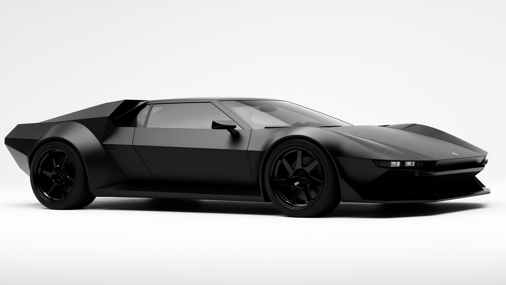
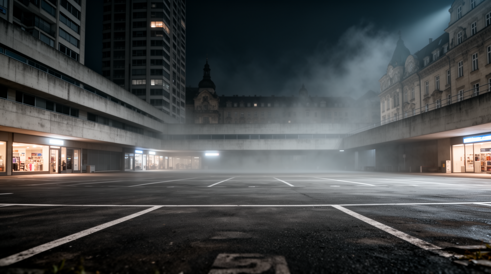
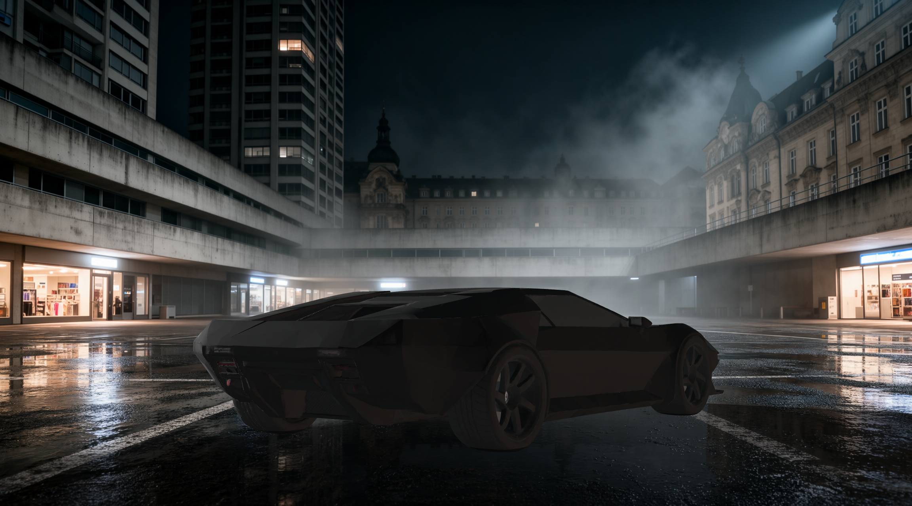
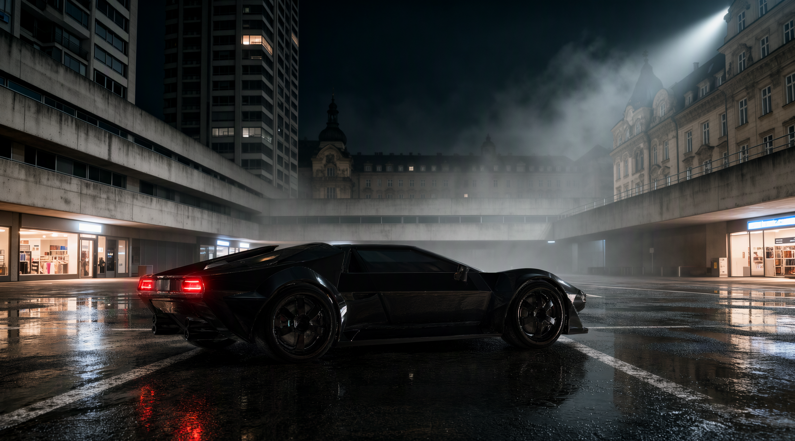
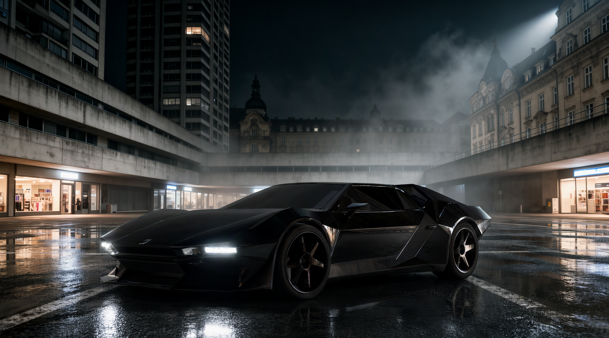
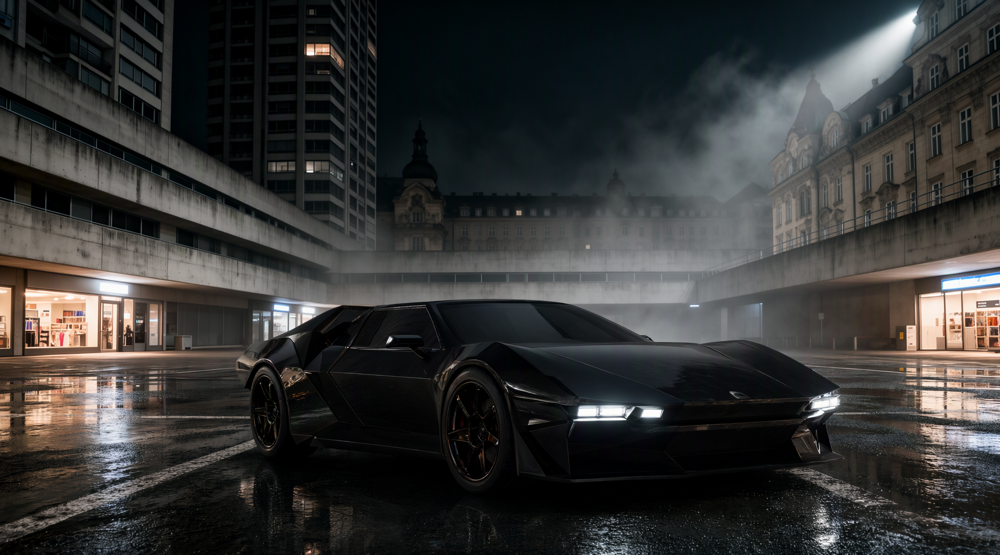

# 🏗️ PH's AIxArchviz ComfyUI Workflow (3D Compositing)

**Image → 3D mesh → camera-matched placement → AI enhancement**

**Author:** Paul Hansen  
**Version:** v1.0_261009  
**License:** CC BY-SA 4.0
---

<table>
  <tr>
    <th width="28%">Inputs (FLUX.2 [dev])</th>
    <th>Raw 3D mesh placed on the background (NKD 3D Preview)</th>
  </tr>
  <tr>
    <td valign="top">
      <br>
      <sub>Object image → 3D mesh</sub><br><br>
      <br>
      <sub>Background plate</sub>
    </td>
    <td valign="top">
      
    </td>
  </tr>
</table>

### Outputs (Qwen Image 2.1 enhancement)

<table>
  <tr>
    <td></td>
    <td></td>
  </tr>
  <tr>
    <td></td>
    <td></td>
  </tr>
</table>

---

### 🏆 Sponsorship

-   Please consider sponsoring me if you find the results of my work useful. A good way to keep code development open and free is through sponsorship.

-   [](https://github.com/sponsors/paulh4x) . [](https://www.paypal.com/paypalme/paulh4x) . [](https://ko-fi.com/paulhansen)

---

## 📺 Resources

* 💬 **Discord:** [PH's AIxArchviz Discord](https://discord.gg/3UW5ZaWpWq)
* 🌐 **Web:** [https://www.paulhansen.de](https://www.paulhansen.de)
* 📸 **Instagram:** [https://www.instagram.com/paulhansen.design/](https://www.instagram.com/paulhansen.design/)
* 💼 **LinkedIn:** [https://www.linkedin.com/in/ph3d](https://www.linkedin.com/in/ph3d)

---

## 🎯 Overview

This workflow composites an object generated from a single image into a background plate, with matching perspective, and then lets an image model blend it in.

It is built around the **[ComfyUI-NKD-VFX-Tools](https://github.com/Nekodificador/ComfyUI-NKD-VFX-Tools) by [Nekodificador](https://github.com/Nekodificador)**. His fSpy camera matching and 3D viewer nodes do the core work here: they make it possible to solve the background camera and place a mesh into the shot inside ComfyUI.

| Step | What happens | Nodes |
|---|---|---|
| **1. Inputs** | An object image and a background plate, both generated with FLUX.2 [dev] in this example | `LoadImage` |
| **2. Image → 3D** | Turn the object image into a textured mesh, with **two options**: | |
| | a) **TRELLIS.2**: open source, runs locally with ComfyUI native nodes | ComfyUI core |
| | b) **Meshy 7**: partner API node (uses Comfy credits) | `MeshyImageToModelNode` |
| **3. Camera match** | Solve the background camera from vanishing points (2-point mode) | `NKDfSpyCamera` (Nekodificador) |
| **4. Placement** | Place, rotate and scale the mesh on the background in the 3D viewer, rendered with the solved camera | `NKDPreview3D` (Nekodificador) |
| **5. Enhancement** | Qwen Image 2.1 adds reflections, lighting and contact shadows so the mesh matches the plate, while keeping its silhouette | Qwen Image 2.1 subgraph |
| **6. Output** | Save, plus a before/after compare | `ImageCompare`, `SaveImageAdvanced` |

---

## ✨ Key Features

- **Two image-to-3D routes:** free and local with **TRELLIS.2**, or hosted with **Meshy 7** (meshy-7.1, PBR textures, up to 300k triangles)
- **fSpy camera matching in ComfyUI** with Nekodificador's `NKDfSpyCamera`: set the vanishing-point lines on the background and get a matching camera
- **Interactive 3D placement** with Nekodificador's `NKDPreview3D`: the mesh is rendered with the solved camera at the background's resolution (2304×1280 in this example)
- **Front / back view switch:** a boolean switch (*Switch: Front/Back light*) fills the `{carlight}` token in the prompt, so it describes the side of the object the camera sees (e.g. `bright white frontlights` or `red backlights`)
- **Qwen Image 2.1 enhancement** packed into a subgraph with only the relevant controls exposed

---

## 📦 Models Used

| Folder | Model |
|---|---|
| `diffusion_models` | `qwen_image_2.1_int8_convrot.safetensors` |
| `text_encoders` | `qwen3vl_8b_int8_convrot.safetensors` |
| `vae` | `qwen_image_2.1_vae_bf16.safetensors` |
| *(TRELLIS.2 route)* | TRELLIS.2 models used by the ComfyUI native nodes |
| *(Meshy route)* | none locally, Meshy 7 runs as a partner node and needs a Comfy account with credits |

The FLUX.2 [dev] input images are included in [`assets`](assets). You don't need FLUX.2 to run this workflow; any object image and background plate will do.

---

## 🔧 Custom Nodes Required

| Node pack | Author | Used for |
|---|---|---|
| [ComfyUI-NKD-VFX-Tools](https://github.com/Nekodificador/ComfyUI-NKD-VFX-Tools) | Nekodificador | fSpy camera match, 3D viewer / placement |

Everything else is ComfyUI core and partner nodes. Install via the [ComfyUI-Manager](https://github.com/Comfy-Org/ComfyUI-Manager), or:

```bash
cd <YOUR_PATH_TO_COMFYUI>/ComfyUI/custom_nodes/
git clone https://github.com/Nekodificador/ComfyUI-NKD-VFX-Tools
```

The workflow uses subgraphs. Update ComfyUI and its frontend before loading it.

---

## 📁 Repository Structure

```
📂 AIxArchviz_3d_compositing/
├── 📂 workflow/   → ph_3d_compositing_01.json
└── 📂 assets/     → FLUX.2 [dev] inputs, raw mesh composite and enhanced outputs
```

---

## 📝 Version History

### v1.0_261009

- Initial release: TRELLIS.2 / Meshy 7 image-to-3D, NKD fSpy camera match and 3D placement, Qwen Image 2.1 enhancement, front/back view switch

---

## 🙏 Acknowledgements

**Special thanks to:**
- **[Nekodificador](https://github.com/Nekodificador)** for [ComfyUI-NKD-VFX-Tools](https://github.com/Nekodificador/ComfyUI-NKD-VFX-Tools). The fSpy integration and 3D viewer are what make this workflow possible
- [fSpy](https://fspy.io/) for the original camera matching approach
- [Microsoft](https://github.com/microsoft/TRELLIS.2) for TRELLIS.2
- [Meshy](https://www.meshy.ai/) for Meshy 7
- The Qwen team for Qwen Image 2.1
- [Black Forest Labs](https://huggingface.co/black-forest-labs) for FLUX.2 [dev], used for the input images
- [Comfy-Org](https://github.com/Comfy-Org) for ComfyUI
- The ComfyUI community

---

## ⚖️ License

**PH's AIxArchviz ComfyUI Workflow (3D Compositing)** © 2026 by Paul Hansen is licensed under [CC BY-SA 4.0](https://creativecommons.org/licenses/by-sa/4.0/).

The models, custom nodes and partner services used have their own licenses and terms (e.g. the FLUX.2 [dev] Non-Commercial License). Check each one before any commercial use.
